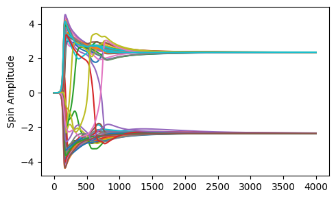

# Chaotic Amplitude Control for Coherent Ising Machine

## Description & Motivation
This repository contains a implementation of a simulator of the Coherent Ising Machine (CIM) using Chaotic Amplitude Control (CAC) algorithm to help escape the local minima and search for global ground state. Data analysis and simulations for this study were performed on a MacBook Pro on macOS with a 2 GHz quad-core Intel Core i5 processor and 16 GB 3733 MHz LPDDR4X RAM. The CIM was engineered as a photonic device specifically for heuristically tackling Ising-optimization problems. Simulating the CIM involves an unconventional approach rooted in dynamical systems, forming a heuristic algorithm that effectively solves Ising problems.

The Hamiltonian of the Ising model, representing the total energy of the system, is given by:

$$H = - \sum_{i,j} J_{ij} \sigma_i \sigma_j - \sum_i h_i \sigma_i$$
where $J$ is the $N \times N$ coupling matrix and $h$ is the external field. In this project, no external field is considered. $ \sigma_i \sigma_j$ represent the Ising spin. The project is aimed to reproduce the results of the below papers by integrating the listed algorithms.

- Amplitude-Heterogeneity-Correction variant of the CIM algorithm
"
T. Leleu, Y. Yamamoto, P.L. McMahon, and K. Aihara, Destabilization of local minima in analog spin systems by correction of amplitude heterogeneity. Physical Review Letters 122, 040607 (2019). https://doi.org/10.1103/PhysRevLett.122.040607"

- Chaotic-Amplitude-Control variant of the CIM algorithm
"T. Leleu, F. Khoyratee, T. Levi, R. Hamerly, T. Kohno, K. Aihara. Scaling advantage of chaotic amplitude control for high-performance combinatorial optimization. Commun Phys 4, 266 (2021). https://doi.org/10.1038/s42005-021-00768-0"


## Contents
- [Installation](#installation)
- [Usage](#Usage)
- [Features](#features)
- [Frameworks](#frameworks)
- [Credits](#credits)
- [Generation Tools](#generation-tools)
- [ChatGPT and Copiot](#generation-tools)

## Installation
The project is uploaded in gitLab. To install the application, clone the repository:
```bash
git clone https://github.com/Fanyi-Kaitlyn-Wu/Coherent_Ising_Machine.git
```
Navigate to the project directory and install the dependencies.

### Dependencies
This project is written in Python (The project was developed using python=3.9.18). To run the project,
**Python 3** or later need to be installed.
Necessary packages used in the project are listes in environment.yml. They are:

- [numpy](https://numpy.org/) - A fundamental package for scientific computing in Python.
- [PyTorch](https://pytorch.org/) - An open source machine learning library used for applications such as computer vision and natural language processing.
- [Jupyter Notebook](https://jupyter.org/) - An open-source web application that allows you to create and share documents that contain live code, equations, visualizations, and narrative text.
- [MLOOP](https://github.com/michaelhush/M-LOOP) - A machine learning optimization library for optimizing experimental and computational processes. This is used for tuning the parameters.

for generating offline documentation:

- [doxygen](http://www.doxygen.nl/) - A tool for generating documentation from annotated code.

For full details on all packages, please refer to the `environment.yml` file.

## Usage
All the modules, functions and classes for the CIM algorithm is saved in the `src` folder.
The testing intances are the Gsets and MAX-CUT instances, which are saved in `G_sets` and `MC_Instances` folders respectively.
The `Notebooks` folder contains the **introductions** to the project and the algorithm. They cover topics from solving an Ising model to hyperparameter optimisation.

To solve for a intance, run the `Solve_Ising.py` file in `src` folder a single command line with the path to the example MAX-CUt files in `MC_Instances` folder as an argument:
```bash
$ python src/Solve_Ising.py MC_Instances/MC50_N=50_1.npz
```
Make sure you are in the project directory when running the command. The solver `Solve_Ising.py` is inside the `src` folder, and the `MC50_N=50_1.npz` file should in the `MC_Instances` folder. If you want to solve for G sets, you need to convert the graph problem to a J coupling matrix. The detailed procedures for solving Gsets are shown in `Gset Evaluation` folder in `Notebooks`.

The simple usage of the code is:
```
results = CIM_AHC_GPU(T_time=20, 
                      J=J, 
                      batch_size=1, 
                      time_step=0.01, 
                      custom_fb_schedule=None, 
                      custom_pump_schedule=None)
spin_config, x_trajectory, t, energy_plot_data, error_var_data, divg, kappa = results

```

The output terminal will display the ground state found for Ising model, and the corresponding MAX-CUT energy, as well as the time for reaching the ground state. Also, the figures for the simulation will be generated.




## Features
- **Insing Model Solving**: Solves Ising model effectively. Finds the optimal ground state and corresponding spin configurations.
- **File I/O**: Reads instances from the either `G_sets` or `MC_Instances` folders and writes solutions to the terminal. 
- **Efficiency Evaluation**: Measures and displays the time taken for reaching the solution in the solving process.
- **CLI Interface**: Offers a simple command-line interface for ease of use.

## Frameworks
- **Language**: Python 3.9.19
- **Containerisation**: Docker was used for reproducing the project. Key configurations include continuumio/miniconda3 as the base image for a Miniconda-based Python environment. It sets /usr/IsingSolver as the working directory, and copies all project files into the container. The environment is set up by executing conda env update using the `environment.yml` file, and the Docker shell is configured to use the sudoku-solver-env. It is runnable by using the single command:
```bash
docker run ising-solver
```

## Credits
Author: Fanyi Wu

## Generation Tools
- [VSCode](https://code.visualstudio.com/) - Python IDE for development.
- [Git](https://git-scm.com/) - Version control system for managing code versions and collaboration.
- [Docker](https://www.docker.com/) - Containerization platform for ensuring consistent environments.
- [Doxygen](https://www.doxygen.nl/index.html) - Documentation generator tool used for writing software documentation from annotated source code.
- [Copilot](https://github.com/features/copilot) - Autofill codes and debug for the scripts.


## ChatGPT (https://www.chat.openai.com/)
AI generation tool used to help with developing and embellishing the project.

## Ising Model Contributions

During the project implementation involving the Ising model, various computational techniques and insights from the ChatGPT were utilized. Here are detailed descriptions of these interactions, how the insights were integrated, and the modifications made to adapt the suggestions to the project's specific requirements.

### Model Setup and Configuration

**Inquiry**: Investigated the optimal setup for simulating the Ising model across different temperature regimes.
- **ChatGPT Output**: Recommendations on lattice configurations, boundary conditions, and temperature scaling.
- **Application**: Configured the simulation environment with suggested lattice structures and temperature scales, adapted to study phase transitions in ferromagnetic and antiferromagnetic systems.

### Simulation Optimization

**Inquiry**: What are the efficient algorithms for simulating the Ising model dynamics?
- **ChatGPT Output**: Insights into Monte Carlo methods like the Metropolis-Hastings algorithm and Wolff algorithm for spin flip simulations.
- **Application**: Implemented these algorithms, optimizing them for increased computational efficiency and accuracy in capturing critical phenomena.

### Gset to J Matrix Conversion

**Inquiry**: How to convert graph-based Gset data into a J matrix suitable for Ising model simulations?
- **ChatGPT Output**: Methodologies for transforming graph adjacency matrices into Ising model J matrices.
- **Application**: Developed a conversion algorithm that translates Gset graph data into J matrices, ensuring accurate representation of interaction strengths for Ising simulations.

### Chaotic Amplitude Control

**Inquiry**: Techniques for controlling amplitude in chaotic systems within the context of statistical mechanics simulations.
- **ChatGPT Output**: Overview of control methods for chaotic systems and their application to physical simulations.
- **Application**: Implemented amplitude control techniques in simulation scenarios to stabilize system behavior under chaotic conditions, enhancing the predictability and reliability of simulation outcomes.

### Ising Energy to Max-Cut Conversion

**Inquiry**: How to translate Ising model energy configurations into Max-Cut problems?
- **ChatGPT Output**: Detailed steps for mapping Ising model energies to Max-Cut problem formulations.
- **Application**: Applied the conversion technique to analyze Ising model simulations in terms of graph theory, facilitating a broader application of the results to optimization problems.

### Using MLOOP

**Inquiry**: How to implement and utilize MLOOP for optimizing simulation parameters in complex systems?
- **ChatGPT Output**: Instructions and best practices for integrating MLOOP into scientific simulations.
- **Application**: Integrated MLOOP to automate the tuning of simulation parameters, significantly enhancing model performance and reducing manual tuning efforts.

### Visualization and Analysis

**Inquiry**: Requested methods for visualizing magnetization and correlation functions over time.
- **ChatGPT Output**: Techniques for plotting state changes and correlation data.
- **Application**: Developed visualization tools that dynamically display the evolution of the system state, aiding in the analysis of critical behavior and phase transitions.

### Theoretical Background and Literature Review

**Inquiry**: Sought a concise theoretical foundation on statistical mechanics related to the Ising model and relevant academic papers.
- **ChatGPT Output**: A summary of fundamental principles in statistical mechanics with references to seminal papers on the Ising model.
- **Application**: The theoretical overview informed the introduction and discussion sections of the project documentation, incorporating suggested readings to substantiate the methodology and results discussion.

### Debugging and Code Refinement

**Inquiry**: Consulted on best practices for debugging complex simulation code and improving code readability.
- **ChatGPT Output**: Strategies for debugging scientific code and enhancing code structure for readability and maintainability.
- **Application**: Applied these strategies to refine the codebase, making it more modular and easier to troubleshoot, enhancing overall project maintainability.
